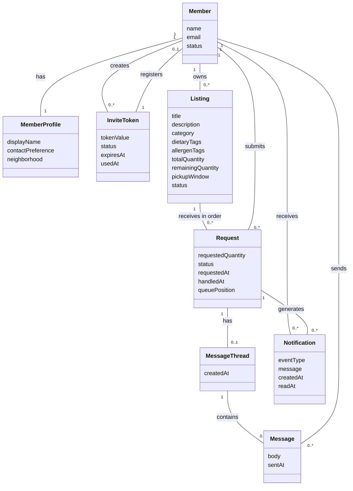

# Current-State Domain Model Sketch: Local Produce Exchange

## Repository synthesis note

This sketch was added after the original requirements text. It is not copied
from the original project requirements. It is synthesized from:

- `current-state-use-cases.md`, especially the actor definitions and use cases
  UC-01 through UC-12.
- `current-state-team-charter.md`, especially the project vision, in-scope
  features, and project artifact list.
- `current-state-user-stories.md`, especially stories US-01 through US-12,
  their acceptance criteria, and the traceability table.
- `../requirements.md`, especially the Local Produce Exchange overview and the
  expanded domain model note in the Requirements section.

This is a conceptual domain model. It describes the main things in the problem
area and how they relate. It is not an ERD, SQL schema, or implementation class
design.

## Scope represented here

This sketch follows the current-state scope:

- Invite-only registration and login.
- Member accounts and member profiles.
- Seeded active listings.
- Browse, search, and filter active listings.
- Request queue for each listing.
- Request approval, denial, and withdrawal.
- Private message thread connected to a request.
- Notifications for request events.

This sketch uses `../requirements.md` as broader project context, but it does
not model every future requirement as a current-state entity. The full
requirements mention posting listings, pickup, completion, ratings, reviews,
admin suspension, listing deactivation, reports, photos, and pickup reminders.
Those are listed later as possible additions because the current-state use cases
and user stories do not yet model them as active scope.

## Plain-language sketch

Read this as a first draft you could redraw on paper.

```text
InviteToken
  tokenValue
  status
  expiresAt
  usedAt

Member
  name
  email
  status

MemberProfile
  displayName
  contactPreference
  neighborhood

Listing
  title
  description
  category
  dietaryTags
  allergenTags
  totalQuantity
  remainingQuantity
  pickupWindow
  status

Request
  requestedQuantity
  status
  requestedAt
  handledAt
  queuePosition

MessageThread
  createdAt

Message
  body
  sentAt

Notification
  eventType
  message
  createdAt
  readAt
```

```text
Member creates 0..* InviteTokens
InviteToken is used to register 0..1 Member

Member has 1 MemberProfile
MemberProfile belongs to 1 Member

Member owns 0..* Listings
Listing is owned by 1 Member

Listing receives 0..* Requests
Request is for 1 Listing

Member submits 0..* Requests
Request is submitted by 1 Member

Listing has an ordered request queue made from its REQUESTED Requests
Request has a queue position while it is still pending

Request has 0..1 MessageThread
MessageThread coordinates 1 Request

MessageThread contains 0..* Messages
Message is part of 1 MessageThread

Member sends 0..* Messages
Message is sent by 1 Member

Member receives 0..* Notifications
Notification is sent to 1 Member

Request generates 0..* Notifications
Notification concerns 1 Request
```

## Simple diagram sketch

This is not strict UML yet. It is a readable map of the domain.

```text
Member 1 ------------------------------- 0..* InviteToken
           creates

InviteToken 1 -------------------------- 0..1 Member
              registers

Member 1 ------------------------------- 1 MemberProfile
           has


Member 1 ------------------------------- 0..* Listing
           owns

Listing 1 ------------------------------ 0..* Request
           receives as ordered queue

Member 1 ------------------------------- 0..* Request
           submits


Request 1 ------------------------------ 0..1 MessageThread
          has

MessageThread 1 ------------------------ 0..* Message
                  contains

Member 1 ------------------------------- 0..* Message
           sends


Member 1 ------------------------------- 0..* Notification
           receives

Request 1 ------------------------------ 0..* Notification
           generates
```

## Mermaid drawing aid

This Mermaid diagram is a drawing aid, not a replacement for the final
hand-drawn or diagram-tool version. Mermaid class diagrams are close enough to
show the UML-style boxes, attributes, relationship names, and multiplicities.
When redrawing by hand, copy the boxes, copy the attributes, draw the
relationship lines, and place the multiplicity labels near the ends of each
line.



If this block appears as plain text instead of a rendered diagram, the Markdown
viewer does not support Mermaid rendering. The rendered fallback image below is
generated from the same Mermaid source.

Rendered fallback images:


### How to read the Mermaid diagram

- `Member "1" -- "0..*" Listing : owns` means one member can own zero or
  more listings, and each listing is owned by one member. In the current-state
  use cases, that owner is the poster for the listing.
- `Listing "1" -- "0..*" Request : receives in order` means one listing can
  receive zero or more requests, and each request is for one listing. The
  current-state scope treats pending requests as the listing's queue.
- `Member "1" -- "0..*" Request : submits` means one member can submit zero or
  more requests, and each request is submitted by one member. In the
  current-state use cases, that submitter is the recipient for the request.
- The `Poster` role is represented by the `Member owns Listing` relationship.
- The `Recipient` role is represented by the `Member submits Request`
  relationship.
- The request queue is represented by the ordered relationship between
  `Listing` and `Request`, plus the `queuePosition` attribute on `Request`.

## Relationship notes for hand redraw

| Relationship | Why it belongs in the domain model | Source evidence |
| :---- | :---- | :---- |
| Member creates InviteToken | Current-state scope includes invite-only access. The current use cases assume a member may issue invite tokens, but the user stories mark the issuer rule as an assumption to confirm. | `current-state-use-cases.md` UC-04; `current-state-user-stories.md` US-04 |
| InviteToken registers Member | A guest registers with a valid, unused invite token. The token is then marked used and a member account exists. | `current-state-use-cases.md` UC-01; `current-state-user-stories.md` US-01 |
| Member has MemberProfile | Members can view and update their own profile details. | `current-state-use-cases.md` UC-05; `current-state-user-stories.md` US-05 |
| Member owns Listing | The current-state use cases define Poster as the member who owns a listing. | `current-state-use-cases.md` actor definitions, UC-09, UC-10 |
| Listing receives Request | A recipient submits a quantity request for an active listing. | `current-state-use-cases.md` UC-08; `current-state-user-stories.md` US-08 |
| Listing orders pending Requests as a queue | The request is placed at the end of the listing's queue and the poster sees pending requests oldest first. | `current-state-use-cases.md` UC-08 and UC-09; `current-state-user-stories.md` US-08 and US-09 |
| Member submits Request | Recipient is not a separate account type. It is the role a member plays when submitting a request. | `current-state-use-cases.md` actor definitions and UC-08 |
| Poster handles Request | Poster is not a separate account type. It is the member who owns the listing for the request. | `current-state-use-cases.md` UC-09 and UC-10; `current-state-user-stories.md` US-09 and US-10 |
| Request has MessageThread | The private thread links the poster and recipient for one request. | `current-state-use-cases.md` UC-12; `current-state-user-stories.md` US-12 |
| MessageThread contains Message | Members send and read messages in the private thread. | `current-state-use-cases.md` UC-12; `current-state-user-stories.md` US-12 |
| Member sends Message | A sender must be the poster or recipient for the request. | `current-state-use-cases.md` UC-12; `current-state-user-stories.md` US-12 |
| Member receives Notification | The system notifies the poster or recipient when request events happen. | `current-state-use-cases.md` UC-08, UC-10, UC-11 |
| Request generates Notification | Notifications are tied to request events such as new request, approval, denial, or withdrawal. | `current-state-use-cases.md` UC-08, UC-10, UC-11 |

## Attribute provenance and notes

Most attributes in this sketch trace straight back to the use cases, the user
stories, the team charter, or the project requirements. A few do not yet, or
need a caveat. They are called out here so a reviewer does not mistake a
proposed attribute for a confirmed one.

Proposed attributes, not yet named in any source document. These are reasonable
guesses that fill out the entity, but the current-state documents do not list
them. Confirm them with the team or remove them.

- `MemberProfile.displayName`, `MemberProfile.contactPreference`, and
  `MemberProfile.neighborhood`. UC-05 and US-05 only speak of "profile details"
  in general. They do not name these specific fields.
- `Notification.readAt`. No source describes read or unread tracking for
  notifications. It is included only as a likely future need.

Attribute tied to an open question. Include it only if the team resolves the
question.

- `InviteToken.expiresAt`. US-01's notes say token expiry rules are not yet
  defined and must be confirmed. Until the team decides whether tokens expire,
  treat this attribute as pending, not settled.

Derived attributes, computed from other facts rather than stored on their own.
In strict UML these would carry a leading slash.

- `Request.queuePosition`. Read off the ordered relationship between a `Listing`
  and its pending `Request` objects. See the RequestQueue note below.
- `Listing.remainingQuantity`. Equal to the total quantity minus the quantity
  already approved. It is kept as its own attribute only because the
  conflict-prevention rule in UC-10 reads from it directly.

## Important modeling decisions

### Who may issue invite tokens is an unconfirmed assumption

The `Member creates InviteToken` relationship rests on US-04 and UC-04, which
both flag the issuer rule as an assumption. The source documents require
invite-only registration but do not say who issues tokens, whether any active
member or only an admin. The relationship is drawn here so the model is
complete, but keep the assumption note attached when presenting the diagram. If
the team decides only an admin issues tokens, this relationship will need to be
narrowed.

### Poster and Recipient are roles, not separate classes

Do not draw separate `Poster` and `Recipient` entity boxes unless the team later
decides they are separate account types. The current-state use cases explicitly
say Poster and Recipient are roles a `Member` plays for a specific listing or
request.

In the UML-style diagram, show this through relationships:

- A `Member` owns a `Listing`. In that relationship, the member is the poster.
- A `Member` submits a `Request`. In that relationship, the member is the
  recipient.

### Guest is probably not a persistent domain entity

The current-state use cases define Guest as a person who holds an invite token
but has not registered yet. For the domain model, it is cleaner to model
`InviteToken` and `Member` instead of drawing `Guest` as a persistent entity.
You can mention Guest as an actor outside the diagram if needed.

### RequestQueue is a relationship and rule, not a separate class here

The current-state team charter names a Request Queue as in scope, and the use
cases say requests are handled in received order. This sketch models the queue
as the ordered set of pending `Request` objects attached to a `Listing`.

The `queuePosition` attribute on `Request` is a derived value, not an
independent fact. It is read off the ordered relationship between a `Listing`
and its pending `Request` objects, so it is shown only as a reading aid. In a
strict UML domain model a derived attribute is written with a leading slash, as
in `/queuePosition`. Do not treat it as a stored field. If the team decides the
queue does not need an explicit position attribute at all, drop it and rely on
the ordered relationship alone.

If the team later treats queue management as a separate domain concept with its
own lifecycle, then `RequestQueue` could become its own box. For the current
scope, that would add complexity without adding much understanding.

### A request has at most one message thread

This sketch links a `Request` to `0..1 MessageThread`, not to exactly one. A
thread is created only when there is something to coordinate, so a request that
was just submitted, denied, or withdrawn may have no thread at all. Modeling the
thread as optional avoids claiming every request owns a thread it may never use.

Note one scope difference from the full project requirements. The full
requirements attach the private message thread to an exchange, meaning an
approved request that moves toward pickup. The current-state slice does not yet
model pickup or completion, so this sketch attaches the thread to the request
itself. If the team later adds the exchange concept, move the thread onto the
`Exchange` entity listed under possible later additions.

### Request status is a domain concept

In the current-state scope, request status values are:

- `REQUESTED`
- `APPROVED`
- `DENIED`
- `CANCELLED`

The full project requirements also mention:

- `PICKED_UP`
- `COMPLETED`

For this current-state diagram, include only the current-state statuses unless
the team wants the diagram to cover the full future lifecycle.

### Listing creation is not modeled as current-state behavior

The full requirements say members can post listings. The current-state use cases
say active listings are seeded and creating listings is out of the current
scope. The domain model still includes `Listing` because browsing, viewing,
requesting, and queues all depend on it. If the team redraws this for the full
project, add the listing creation behavior and any listing creation rules.

## How to redraw this as UML-compliant

Use this current-state sketch as a guide:

1. Draw one UML class-style box for each main domain entity.
2. Put only the entity name at the top of the box.
3. Put plain attribute names in the attribute section.
4. Do not include methods.
5. Do not include visibility symbols such as `+`, `-`, or `#`.
6. Do not include SQL types or TypeScript/Python types.
7. Draw plain association lines between entity boxes.
8. Write a short verb phrase on each relationship line, such as `owns`,
   `submits`, `receives in order`, `contains`, or `sends`.
9. Add multiplicity at both ends of each relationship, such as `1`, `0..1`,
   `0..*`, or `1..*`.
10. Keep database details out of this diagram. Do not draw foreign keys,
    primary keys, indexes, join tables, or table names unless they are also
    real domain concepts.

## Suggested UML boxes

Use these boxes when redrawing by hand.

```text
+----------------------+
| Member               |
+----------------------+
| name                 |
| email                |
| status               |
+----------------------+

+----------------------+
| MemberProfile        |
+----------------------+
| displayName          |
| contactPreference    |
| neighborhood         |
+----------------------+

+----------------------+
| InviteToken          |
+----------------------+
| tokenValue           |
| status               |
| expiresAt            |
| usedAt               |
+----------------------+

+----------------------+
| Listing              |
+----------------------+
| title                |
| description          |
| category             |
| dietaryTags          |
| allergenTags         |
| totalQuantity        |
| remainingQuantity    |
| pickupWindow         |
| status               |
+----------------------+

+----------------------+
| Request              |
+----------------------+
| requestedQuantity    |
| status               |
| requestedAt          |
| handledAt            |
| queuePosition        |
+----------------------+

+----------------------+
| MessageThread        |
+----------------------+
| createdAt            |
+----------------------+

+----------------------+
| Message              |
+----------------------+
| body                 |
| sentAt               |
+----------------------+

+----------------------+
| Notification         |
+----------------------+
| eventType            |
| message              |
| createdAt            |
| readAt               |
+----------------------+
```

## Possible later additions

Add these only if the team wants the domain model to represent the full
requirements instead of only the current-state scope:

- `Photo`, connected to `Listing`.
- `Review`, connected to completed exchange parties.
- `Exchange`, if the team wants a separate concept for an approved request that
  moves through pickup and completion.
- `AdminAction`, if suspension, deactivation, and reporting become part of the
  modeled domain.
- `Report`, if generated admin reports become an explicit domain artifact.
