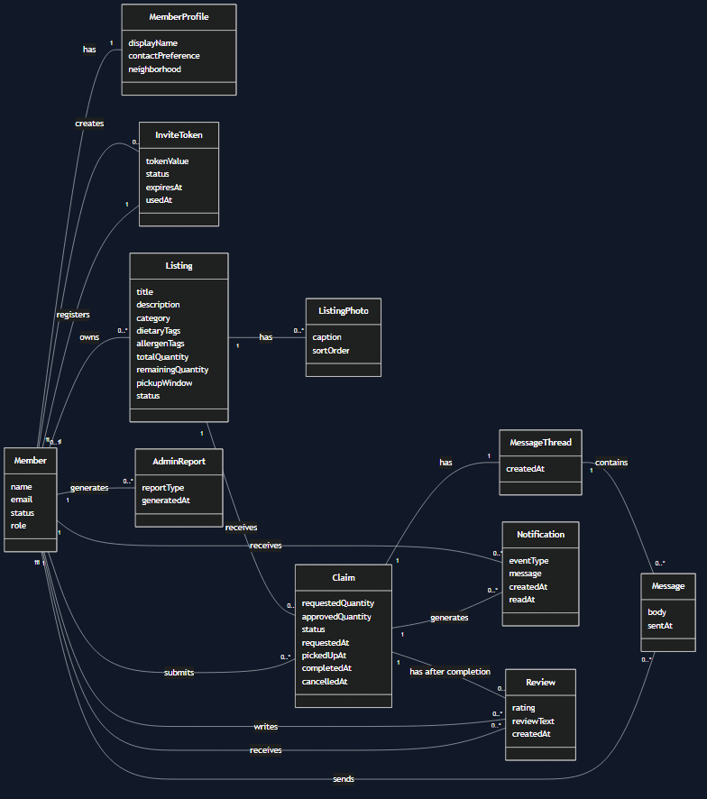
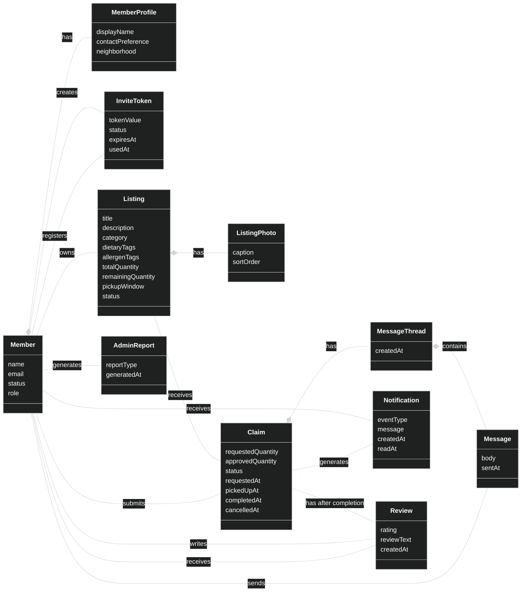

# Domain Model Sketch: Local Produce Exchange

## Repository synthesis note

This sketch was added after the original requirements text. It is not copied
from the original project requirements. It is synthesized from:

- `team-charter.md`, especially the project vision, in-scope features, and
  project artifact list.
- `use-cases.md`, especially the actor definitions, the full use-case list
  UC-01 through UC-24, and the coverage tables.
- `user-stories.md`, especially stories US-01 through US-25, their acceptance
  criteria, and the traceability table.
- `../requirements.md`, especially the Local Produce Exchange overview, sample
  review story, and expanded domain model note in the Requirements section.

This is a conceptual domain model. It describes the main things in the problem
area and how they relate. It is not an ERD, SQL schema, or implementation class
design.

## Scope represented here

This sketch follows the full artifact plan in `use-cases.md` and
`user-stories.md`:

- Invite-only registration and login.
- Member accounts and member profiles.
- Members posting, editing, and deactivating listings.
- Optional photos on listings.
- Browse, search, filter, and view listings.
- Claim lifecycle from request through approval, pickup, completion, denial, or
  cancellation.
- Private message thread for each exchange.
- Status notifications.
- Ratings and reviews after completion.
- Member dashboard and activity overview.
- Admin suspension, admin listing deactivation, and basic reports.

The stretch pickup reminder use case is not modeled as a core entity here. It
can be added later if the team decides to implement it.

## Plain-language sketch

Read this as a first draft you could redraw on paper.

```text
InviteToken
  tokenValue
  status
  expiresAt
  usedAt

Member
  name
  email
  status
  role

MemberProfile
  displayName
  contactPreference
  neighborhood

Listing
  title
  description
  category
  dietaryTags
  allergenTags
  totalQuantity
  remainingQuantity
  pickupWindow
  status

ListingPhoto
  caption
  sortOrder

Claim
  requestedQuantity
  approvedQuantity
  status
  requestedAt
  pickedUpAt
  completedAt
  cancelledAt

MessageThread
  createdAt

Message
  body
  sentAt

Notification
  eventType
  message
  createdAt
  readAt

Review
  rating
  reviewText
  createdAt

AdminReport
  reportType
  generatedAt
```

```text
Member creates 0..* InviteTokens
InviteToken is used to register 0..1 Member

Member has 1 MemberProfile
MemberProfile belongs to 1 Member

Member owns 0..* Listings
Listing is owned by 1 Member

Listing has 0..* ListingPhotos
ListingPhoto belongs to 1 Listing

Listing receives 0..* Claims
Claim is for 1 Listing

Member submits 0..* Claims
Claim is submitted by 1 Member

Claim has 1 MessageThread
MessageThread coordinates 1 Claim

MessageThread contains 0..* Messages
Message is part of 1 MessageThread

Member sends 0..* Messages
Message is sent by 1 Member

Member receives 0..* Notifications
Notification is sent to 1 Member

Claim generates 0..* Notifications
Notification may concern 1 Claim

Claim has 0..2 Reviews after completion
Review is about 1 Claim

Member writes 0..* Reviews
Review is written by 1 Member

Member receives 0..* Reviews
Review is about 1 reviewed Member

Member generates 0..* AdminReports when acting as Admin
AdminReport is generated by 1 Member with admin rights
```

## Simple diagram sketch

This is not strict UML yet. It is a readable map of the domain. These plain
dashes do not show the line type. For which lines are compositions and which are
plain associations, see the "What kind of line to draw" section below.

```text
Member 1 ------------------------------- 0..* InviteToken
           creates

InviteToken 1 -------------------------- 0..1 Member
              registers

Member 1 ------------------------------- 1 MemberProfile
           has


Member 1 ------------------------------- 0..* Listing
           owns

Listing 1 ------------------------------ 0..* ListingPhoto
           has

Listing 1 ------------------------------ 0..* Claim
           receives

Member 1 ------------------------------- 0..* Claim
           submits


Claim 1 -------------------------------- 1 MessageThread
        has

MessageThread 1 ------------------------ 0..* Message
                  contains

Member 1 ------------------------------- 0..* Message
           sends


Member 1 ------------------------------- 0..* Notification
           receives

Claim 1 -------------------------------- 0..* Notification
        generates


Claim 1 -------------------------------- 0..2 Review
        has after completion

Member 1 ------------------------------- 0..* Review
           writes

Member 1 ------------------------------- 0..* Review
           receives as reviewed member


Member 1 ------------------------------- 0..* AdminReport
           generates when acting as Admin
```

## Mermaid drawing aid

This Mermaid diagram is a drawing aid, not a replacement for the final
hand-drawn or diagram-tool version. Mermaid class diagrams are close enough to
show the UML-style boxes, attributes, relationship names, and multiplicities.
When redrawing by hand, copy the boxes, copy the attributes, draw the
relationship lines, and place the multiplicity labels near the ends of each
line.

If this block appears as plain text instead of a rendered diagram, the Markdown
viewer does not support Mermaid rendering. The rendered fallback image below is
generated from the same Mermaid source.

Rendered fallback images:



SVG fallback: [domain-model.svg](domain-model.svg)



### How to read the Mermaid diagram

- `Member "1" -- "0..*" Listing : owns` means one member can own zero or
  more listings, and each listing is owned by one member. In the artifact use
  cases, that owner is the poster for the listing.
- `Listing "1" -- "0..*" Claim : receives` means one listing can receive zero
  or more claims, and each claim is for one listing.
- `Member "1" -- "0..*" Claim : submits` means one member can submit zero or
  more claims, and each claim is submitted by one member. In the artifact use
  cases, that submitter is the claimant.
- `Claim "1" -- "0..2" Review : has after completion` means a completed claim
  can have up to two reviews: one from the claimant for the poster and one from
  the poster for the claimant.
- The `Poster`, `Claimant`, and `Admin` roles are represented by relationships
  and member role/status information, not by separate account classes.
- A line written in Mermaid as `*--` is a composition: a solid line with a
  filled diamond at the whole end. For example, `Member "1" *-- "1"
  MemberProfile : has` means the profile is a part of the member. Every other
  line is `--`, a plain association. The four composition lines are listed in
  the next section, "What kind of line to draw."

## What kind of line to draw

This section answers, for every relationship, what kind of line to draw. A
conceptual domain model uses only two of the four UML line types, and this model
uses both. Most relationships are plain associations. Four are compositions.

The four line types, and when each applies:

- Plain association: a solid line, no diamond, with a verb phrase and
  multiplicities at the ends. It is a normal structural link between two
  independent entities. This is the default, and it covers most lines here.
- Composition: a solid line with a filled, solid diamond at the whole end. Use
  it when the part cannot exist without its whole, belongs to exactly one whole,
  and is deleted with it. In the Mermaid source this is written `*--`, and the
  diamond is drawn on the left class.
- Aggregation: a solid line with a hollow, open diamond at the whole end. It
  means a whole-and-part link where the part can still live on its own or be
  shared by more than one whole. This model does not use it. Its UML meaning is
  weak and widely treated as optional, so when a link is not a clear
  composition, use a plain association instead.
- Dependency: a dashed line with an open arrowhead, meaning a loose, temporary
  "uses" link. A conceptual domain model does not use it, so none appear here.

Per-relationship guide.

How to read the two numbers. On each line you write one number next to each
box. The number next to a box says how many of that box take part for one item
on the other side. Example: for "Member 1, InviteToken 0..*", you write 1 next
to the Member box and 0..* next to the InviteToken box. It reads as: one member
can create many invite tokens, and each token was created by exactly one member.

What the numbers mean:

- `1` means exactly one.
- `0..1` means zero or one (optional).
- `0..*` means zero or more. The star means many, with no upper limit. It is the
  same idea some books write as `0..n` or `1..n`.
- `0..2` means zero, one, or two.

For the four compositions, the filled diamond goes on the whole end, which is
also the end labeled `1` in the table below.

| Relationship | Line to draw | Number on each side | Why this line |
| :---- | :---- | :---- | :---- |
| Member creates InviteToken | Plain association | Member `1`, InviteToken `0..*` | A token is an artifact a member issues, not a part of the member. It keeps its own lifecycle and also links to the member who registers with it. |
| InviteToken registers Member | Plain association | InviteToken `1`, Member `0..1` | A lasting structural link that records which member used the token. The `0..1` is itself a sign this is an association, not a dashed dependency. |
| Member has MemberProfile | Composition, diamond at Member | Member `1`, MemberProfile `1` | The profile cannot exist without its member, is one to one, and is removed with the member. |
| Member owns Listing | Plain association | Member `1`, Listing `0..*` | A listing is an independent entity with its own lifecycle and audit history, not a part of the member. You could argue aggregation here, but a plain association is the safer, clearer choice. |
| Listing has ListingPhoto | Composition, diamond at Listing | Listing `1`, ListingPhoto `0..*` | A photo has no meaning without its listing, belongs to exactly one listing, and is removed with it. |
| Listing receives Claim | Plain association | Listing `1`, Claim `0..*` | A claim is a significant entity shared between the listing and the claimant, not owned by the listing alone. |
| Member submits Claim | Plain association | Member `1`, Claim `0..*` | The claimant link. A claim is its own entity, not a part of the member. |
| Claim has MessageThread | Composition, diamond at Claim | Claim `1`, MessageThread `1` | The thread exists only to coordinate one claim and has no independent meaning, so it is removed with the claim. |
| MessageThread contains Message | Composition, diamond at MessageThread | MessageThread `1`, Message `0..*` | A message cannot exist outside its thread and belongs to exactly one thread. |
| Member sends Message | Plain association | Member `1`, Message `0..*` | The author link. A message is part of its thread, not part of the sender, so the sender link stays a plain association. |
| Member receives Notification | Plain association | Member `1`, Notification `0..*` | The recipient link. |
| Claim generates Notification | Plain association | Claim `1`, Notification `0..*` | A notification is about a claim event. See the note on optional compositions below. |
| Claim has Review after completion | Plain association | Claim `1`, Review `0..2` | A review is about one completed exchange. See the note on optional compositions below. |
| Member writes Review | Plain association | Member `1`, Review `0..*` | The reviewer link. A review is not a part of the member. |
| Member receives Review | Plain association | Member `1`, Review `0..*` | The reviewed-party link. |
| Member generates AdminReport | Plain association | Member `1`, AdminReport `0..*` | An admin authors a report. The report is not a part of the member. |

Note on the message thread. The Claim to MessageThread line shows
MessageThread `1`, meaning every claim has a thread. If the team would rather
let a claim exist with no thread yet, for example a claim that was denied before
anyone needed to coordinate, change that end to `0..1`. The diamond stays at
Claim either way.

A note on two optional compositions. `Claim generates Notification` and `Claim
has Review` could each be drawn as a composition, with the diamond at `Claim`,
if the team wants to say a claim's notifications and reviews are parts of that
exchange and should be removed with it. They are left as plain associations here
because each one also links to a `Member`, the recipient or the reviewer or the
reviewed party, so their ownership is less clear-cut than the four compositions
above. Pick one reading and use it consistently.

What this model does not use. There are no aggregation lines, the hollow
diamond, and no dashed dependency arrows. The reason, if a reviewer asks, is
that nothing here is a clear shared or independent whole-and-part link, and a
conceptual domain model does not show temporary "uses" dependencies.

## Relationship notes for hand redraw

| Relationship | Why it belongs in the domain model | Source evidence |
| :---- | :---- | :---- |
| Member creates InviteToken | The project uses invite-only registration, and the artifact use cases carry the assumption that a member may invite another member. | `use-cases.md` UC-04; `user-stories.md` US-04; `requirements.md` project overview |
| InviteToken registers Member | A guest uses a valid, unused invite token to create a member account. | `use-cases.md` UC-01; `user-stories.md` US-01 |
| Member has MemberProfile | The system includes member profiles and a use case for viewing and updating profile details. | `use-cases.md` UC-05; `user-stories.md` US-05; `requirements.md` project overview |
| Member owns Listing | Poster is the member who owns a specific listing. | `use-cases.md` actor definitions, UC-06 through UC-08, UC-14, UC-15 |
| Listing has ListingPhoto | Photos are optional on listings and can be added or managed by the poster. | `use-cases.md` UC-06 and UC-07; `user-stories.md` US-07; `requirements.md` project overview |
| Listing receives Claim | A claimant requests a quantity from an active listing. | `use-cases.md` UC-11; `user-stories.md` US-12 |
| Member submits Claim | Claimant is a role a member plays for a specific exchange, not a separate account type. | `use-cases.md` actor definitions; `user-stories.md` role notes |
| Claim has MessageThread | Each exchange has a private message thread for coordination. | `use-cases.md` UC-16; `user-stories.md` US-17; `requirements.md` project overview |
| MessageThread contains Message | Members send and read messages in the exchange thread. | `use-cases.md` UC-16; `user-stories.md` US-17 |
| Member sends Message | The sender must be one of the parties in the exchange. | `use-cases.md` UC-16; `user-stories.md` US-17 |
| Member receives Notification | Members view status notifications, and claim workflow steps notify the other party. | `use-cases.md` UC-11 through UC-17; `user-stories.md` US-18 |
| Claim generates Notification | Notifications are tied to claim status events such as request, approval, denial, pickup, cancellation, and completion. | `use-cases.md` UC-11 through UC-17 |
| Claim has Review | Reviews are allowed only after completion and are associated with the completed exchange. | `use-cases.md` UC-18 and UC-19; `user-stories.md` US-19 and US-20; `requirements.md` sample review story |
| Member writes Review | A member acting as poster or claimant can review the other party after completion. | `use-cases.md` UC-18; `user-stories.md` US-19 |
| Member receives Review | The reviewed party can view the review associated with the completed exchange. | `use-cases.md` UC-19; `user-stories.md` US-20; `requirements.md` sample review story |
| Member generates AdminReport | Admin is a privileged user role that can generate basic reports. | `use-cases.md` UC-23; `user-stories.md` US-24; `requirements.md` project overview |

## Important modeling decisions

### Poster, Claimant, and Admin are roles, not separate classes

Do not draw separate `Poster`, `Claimant`, or `Admin` entity boxes unless the
team later decides they are separate account types. The artifact use cases say
Poster and Claimant are roles a `Member` plays for a given exchange. Admin is a
privileged user role.

In the UML-style diagram, show this through relationships and attributes:

- A `Member` owns a `Listing`. In that relationship, the member is the poster.
- A `Member` submits a `Claim`. In that relationship, the member is the
  claimant.
- A `Member` can have a role or permission state that lets that member perform
  admin actions.

### Guest is probably not a persistent domain entity

The artifact use cases define Guest as a person who holds an invite token but
has not registered yet. For the domain model, it is cleaner to model
`InviteToken` and `Member` instead of drawing `Guest` as a persistent entity.
You can mention Guest as an actor outside the diagram if needed.

### Claim is the central exchange lifecycle object

The requirements describe a claim request that moves through these statuses:

- `REQUESTED`
- `APPROVED`
- `PICKED_UP`
- `COMPLETED`
- `DENIED`
- `CANCELLED`

The artifact use cases sometimes say "claim" and sometimes say "exchange" after
the claim is active or completed. This model uses `Claim` as the central domain
object for that lifecycle. A completed exchange is a `Claim` whose status is
`COMPLETED`.

### Dashboard is a view, not a separate domain entity

The member dashboard gathers listings, incoming requests, outgoing claims, and
history. That makes it a user-facing view over existing domain objects, not a
separate domain entity in this model.

### Admin reports are modeled lightly

`AdminReport` is included because the full artifact plan includes generating
basic reports. The details are still assumed in the user stories, so the model
keeps this entity small.

## How to redraw this as UML-compliant

Use this artifact sketch as a guide:

1. Draw one UML class-style box for each main domain entity.
2. Put only the entity name at the top of the box.
3. Put plain attribute names in the attribute section.
4. Do not include methods.
5. Do not include visibility symbols such as `+`, `-`, or `#`.
6. Do not include SQL types or TypeScript/Python types.
7. Use the right line for each relationship. Most are plain association lines, a
   plain solid line. Four are compositions, a solid line with a filled diamond at
   the whole: Member to MemberProfile, Listing to ListingPhoto, Claim to
   MessageThread, and MessageThread to Message. Do not use aggregation, a hollow
   diamond, or dashed dependency arrows in this model. See the "What kind of line
   to draw" section for the full per-relationship list.
8. Write a short verb phrase on each relationship line, such as `owns`,
   `submits`, `has`, `contains`, `writes`, or `generates`.
9. Add multiplicity at both ends of each relationship, such as `1`, `0..1`,
   `0..*`, or `0..2`.
10. Keep database details out of this diagram. Do not draw foreign keys,
    primary keys, indexes, join tables, or table names unless they are also
    real domain concepts.

## Suggested UML boxes

Use these boxes when redrawing by hand.

```text
+----------------------+
| Member               |
+----------------------+
| name                 |
| email                |
| status               |
| role                 |
+----------------------+

+----------------------+
| MemberProfile        |
+----------------------+
| displayName          |
| contactPreference    |
| neighborhood         |
+----------------------+

+----------------------+
| InviteToken          |
+----------------------+
| tokenValue           |
| status               |
| expiresAt            |
| usedAt               |
+----------------------+

+----------------------+
| Listing              |
+----------------------+
| title                |
| description          |
| category             |
| dietaryTags          |
| allergenTags         |
| totalQuantity        |
| remainingQuantity    |
| pickupWindow         |
| status               |
+----------------------+

+----------------------+
| ListingPhoto         |
+----------------------+
| caption              |
| sortOrder            |
+----------------------+

+----------------------+
| Claim                |
+----------------------+
| requestedQuantity    |
| approvedQuantity     |
| status               |
| requestedAt          |
| pickedUpAt           |
| completedAt          |
| cancelledAt          |
+----------------------+

+----------------------+
| MessageThread        |
+----------------------+
| createdAt            |
+----------------------+

+----------------------+
| Message              |
+----------------------+
| body                 |
| sentAt               |
+----------------------+

+----------------------+
| Notification         |
+----------------------+
| eventType            |
| message              |
| createdAt            |
| readAt               |
+----------------------+

+----------------------+
| Review               |
+----------------------+
| rating               |
| reviewText           |
| createdAt            |
+----------------------+

+----------------------+
| AdminReport          |
+----------------------+
| reportType           |
| generatedAt          |
+----------------------+
```

## Possible later additions

Add these only if the team wants more detail than the current requirements
artifacts require:

- `PickupReminder`, if the stretch reminder use case becomes core scope.
- `AdminAction`, if the team wants to track suspension and listing deactivation
  as explicit audit-history domain objects.
- `Tag`, if dietary tags and allergen tags need their own lifecycle instead of
  being plain listing attributes.
- `Category`, if categories are managed as their own controlled list instead of
  being plain listing attributes.

