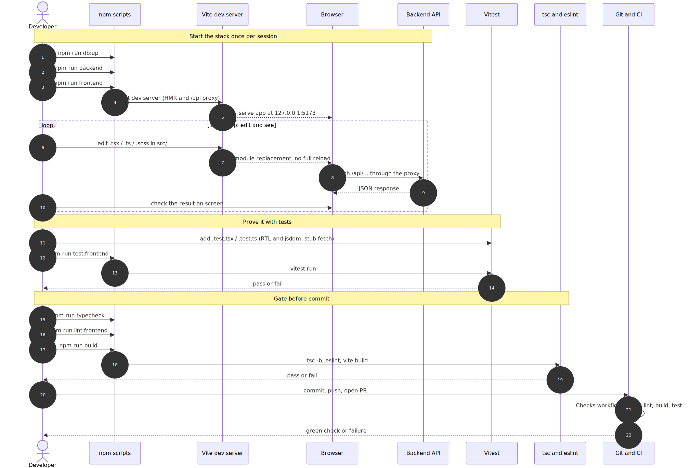
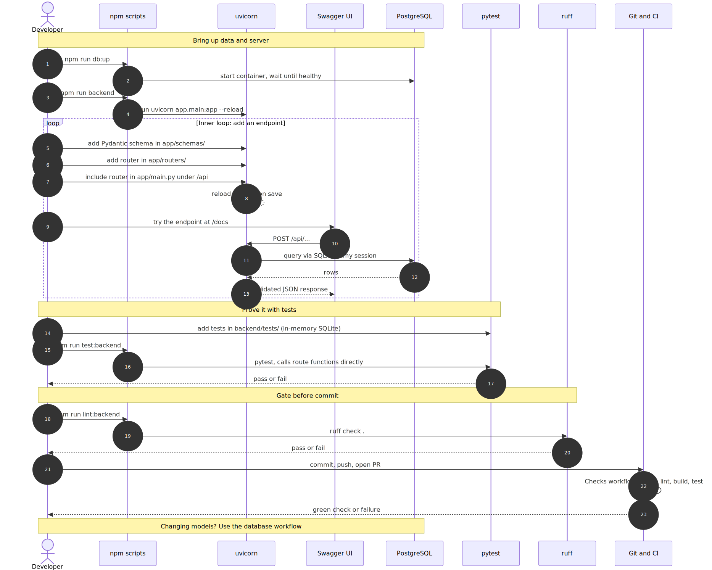
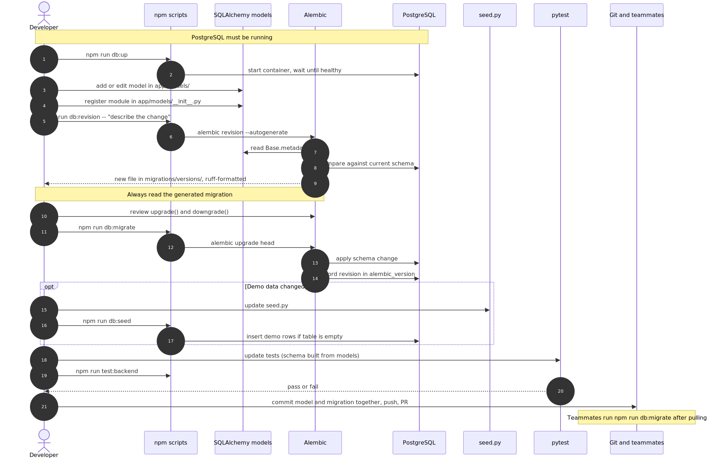

# Surplus: A Local Produce Exchange - Development Workflows

This is the team's how-to guide for changing the app. It answers one question for
each part of the system: "I need to make a change here, what are the steps?" Read
it alongside `surplus-architecture.md`, which shows the static structure and the
runtime request path. This document shows the build-time path: what you, the
developer, do.

There are three workflows, one per tier of the architecture:

- Frontend: what the user sees in the browser.
- Backend: the API that answers the browser.
- Database: where the data lives.

Most real features touch more than one tier. See "A feature that spans all three
tiers" near the end for how they combine.

## How to read these diagrams

Each workflow below is a sequence diagram. A few reading rules:

- The leftmost figure, "Developer," is you. Time runs top to bottom.
- Each arrow is an action or a command. Dashed arrows are responses coming back.
- The yellow bands are phase labels (for example, "Gate before commit").
- A box labeled "loop" is the part you repeat many times while working.
- A box labeled "opt" is a step you do only sometimes.

The diagrams are embedded as SVG images. Their editable Mermaid (`.mmd`) source
and high-resolution PNG copies live in `docs/diagrams/` for slides and print. See
"Regenerating the diagrams" at the end.

## Before you start (shared by all three)

You need three tools installed: Node.js, Astral uv (the Python toolchain), and
Docker Desktop (which runs the database). The first time on a machine, from the
repo root, run `npm run setup`. The repo README has the install details.

During development you keep three terminals open:

| Terminal | Command | What it runs |
| --- | --- | --- |
| 1 | `npm run db` | PostgreSQL in the foreground (or `npm run db:up` to run it in the background) |
| 2 | `npm run backend` | The FastAPI server at `http://127.0.0.1:8000` |
| 3 | `npm run frontend` | The React dev server at `http://127.0.0.1:5173` |

The first time on a machine, after the database is running, also run
`npm run db:migrate` and then `npm run db:seed` to create the tables and insert
the demo rows.

Every workflow shares the same rhythm:

1. Make a small change and see it run (the inner loop).
2. Prove it with an automated test.
3. Run the gate (lint, type check or build, tests) before committing.
4. Push and open a pull request (PR). GitHub Actions runs the "Checks" workflow
   (`setup` then `lint` then `build` then `test`). After review and a green
   check, the PR is merged.

## Frontend workflow



### What this workflow is for

Changes to what runs in the browser: pages, reusable components, styling, and the
code that calls the API. The tools are React (the UI library), TypeScript
(JavaScript with type checking added), Vite (the dev server and build tool), and
Vitest (the test runner).

### Step by step

1. Start the stack (steps 1 to 5 in the diagram). You only need the backend and
   the database running if your screen actually calls the API. For pure layout or
   styling work, the frontend terminal alone is enough. The home page calls the
   API, so to work on it, start all three.
2. Vite serves the app at `127.0.0.1:5173` with two helpers. The first is hot
   module replacement, which means it swaps a changed file into the running page
   without a full refresh, so you see edits almost instantly. The second is the
   `/api` proxy: Vite forwards any request whose path starts with `/api` to the
   backend at `:8000`. That is why your browser code can call `/api/...` with no
   host name and no cross-origin setup.
3. The inner loop (steps 6 to 10) is where you spend most of your time. Edit a
   file under `frontend/src`, save, and the page updates. If the page calls the
   API, the request travels through the proxy to the backend and the JSON comes
   back. You look at the screen and keep adjusting.
4. Prove it with a test (steps 11 to 14). Put a test next to the file it covers.
   There are two kinds. A component test renders the page in jsdom (a fake
   browser that runs in Node) using React Testing Library, then checks what a
   user would see. A service test replaces the global `fetch` with a stub, so it
   checks how your code builds the request and handles the response without any
   backend running. Run `npm run test:frontend`.
5. Run the gate before committing (steps 15 to 19). `npm run typecheck` runs the
   TypeScript compiler (`tsc -b`) to catch type errors. `npm run lint:frontend`
   runs eslint for style and common mistakes. `npm run build` runs the production
   build, which also fails on type or Sass errors. Fix anything that comes back
   red.
6. Commit, push, and open a PR (steps 20 to 22). GitHub Actions runs the same
   steps you just ran, on a fresh machine.

### Where your code goes

| Folder or file | What goes here |
| --- | --- |
| `frontend/src/pages/` | A full screen tied to a URL, such as `HomePage.tsx` |
| `frontend/src/components/` | A reusable piece used by one or more pages |
| `frontend/src/App.tsx` | Wire a new page to a URL by adding a `Route` |
| `frontend/src/services/` | A function that calls an `/api` endpoint with `fetch` |
| `frontend/src/utils/` | Small helpers with no UI |
| `frontend/src/styles/` | Shared SCSS |
| Test files | `Name.test.tsx` or `Name.test.ts` next to the file they cover |

### How it fits the overall architecture

The frontend is the top of the request lifecycle. Your service function is the
first hop, the Vite proxy is the second, and everything below it (FastAPI,
Pydantic, SQLAlchemy, PostgreSQL) exists to answer that one call. See the request
lifecycle diagram in `surplus-architecture.md`. If the endpoint you need does not
exist, that is backend work; switch to the backend workflow.

### Common issues

- The page calls `/api` but gets plain text or a 502 instead of JSON: the backend
  is not running. Start `npm run backend`.
- Types fail in the build but the editor looked fine: run `npm run typecheck` to
  see the same errors the build sees.
- A component test cannot find the DOM: add the comment
  `// @vitest-environment jsdom` at the top of that test file.

## Backend workflow



### What this workflow is for

Changes to the API: the endpoints the frontend calls. The tools are FastAPI (the
web framework), Pydantic (which validates request and response data), SQLAlchemy
(which reads and writes the database), uvicorn (the server that runs the app),
pytest (tests), and ruff (the linter). Python runs through Astral uv, so you
never activate a virtual environment by hand.

### Step by step

1. Bring up the data and the server (steps 1 to 4). `npm run db:up` starts
   PostgreSQL and waits until it accepts connections. `npm run backend` starts
   uvicorn with `--reload`. uvicorn is the server that holds the network port and
   speaks HTTP; `--reload` means it restarts whenever you save a Python file.
2. The inner loop (steps 5 to 13) adds the three pieces of an endpoint. A schema
   in `app/schemas/` is a Pydantic class that describes the request body and the
   response shape. A router in `app/routers/` is the function that handles the
   URL. Then you include that router in `app/main.py` so it is mounted under the
   `/api` prefix. Each save reloads the server.
3. Try it in the browser. FastAPI builds an interactive API page from your type
   hints at `http://127.0.0.1:8000/docs` (called Swagger UI). Open that address
   directly; the docs page lives on the backend and is not behind the Vite proxy,
   which only forwards `/api`. Send a request from that page. The handler
   validates the body with Pydantic, reads the database through a SQLAlchemy
   session that the `get_db_session` dependency hands it, and returns JSON that
   Pydantic shapes.
4. Prove it with tests (steps 14 to 17). pytest tests live in `backend/tests/`.
   They call your route function directly, with no HTTP server, and use an
   in-memory SQLite database built from the same models, so they run fast and
   need no Docker. Run `npm run test:backend`.
5. Run the gate (steps 18 to 20). `npm run lint:backend` runs ruff. Fix anything
   red.
6. Commit, push, and open a PR (steps 21 to 23). CI runs the same steps.
7. One rule to remember (the last note in the diagram): if your change adds or
   alters a database table, stop and use the database workflow to create a
   migration. A new endpoint that only reads or writes tables that already exist
   does not need one.

### Where your code goes

| Folder or file | What goes here |
| --- | --- |
| `backend/app/routers/` | One file per feature area; the endpoint functions |
| `backend/app/schemas/` | Pydantic request and response shapes |
| `backend/app/main.py` | Include each router (this sets the `/api` prefix) |
| `backend/app/db.py` | The `get_db_session` dependency; you use it, rarely change it |
| `backend/tests/` | pytest files named `test_*.py` |

### How it fits the overall architecture

The backend is the middle of the request lifecycle. Your router answers the
`/api` call the frontend makes, Pydantic validates it, and SQLAlchemy reads or
writes the data. See the request lifecycle diagram in `surplus-architecture.md`.
The shape of the data you read is defined by the database workflow.

### Common issues

- The endpoint returns 404: the router is not included in `app/main.py`, or the
  path is missing the `/api` prefix.
- You get a 422 on a request you think is valid: Pydantic rejected the body. Read
  the error detail; it names the field and the reason.
- You get a 503 "could not read sample data": the table does not exist. Run
  `npm run db:migrate` (the database workflow).
- Swagger UI will not load through `:5173`: open it at `:8000/docs` instead. Only
  `/api` is proxied.

## Database change workflow



### What this workflow is for

Changes to the database shape: adding, changing, or removing tables and columns.
The tools are SQLAlchemy models (Python classes that map to tables), Alembic (the
migration tool), PostgreSQL, and the seed script (demo data). This is the most
careful of the three workflows, because a schema change runs on everyone's
database and on the server, not only on yours.

A migration is a small, versioned script that moves the database from one shape
to the next, and can move it back. Think of a numbered set of instructions that
every machine applies in the same order. If you have used Flyway, Liquibase, or
EF Migrations, this is the same idea; the difference is that Alembic can write the
first draft of the script for you.

### Step by step

1. PostgreSQL must be running (steps 1 to 2). Alembic compares your models
   against the live database, so the database has to be up. Run `npm run db:up`.
2. Edit or add a model (steps 3 to 4). A model in `app/models/` is the Python
   class that describes one table. After adding a new model file, register its
   module in `app/models/__init__.py` so Alembic can see it through
   `Base.metadata`, which is the registry of all known tables.
3. Generate the migration (steps 5 to 9). `npm run db:revision -- "describe the
   change"` runs Alembic in autogenerate mode: it reads your models, compares
   them to the current database, and writes a new migration file under
   `backend/migrations/versions/`, already formatted by ruff. The `--` passes
   your message through as the migration title.
4. Always read the generated migration (step 10). Autogenerate produces a good
   first draft, not a guarantee. It can miss column type changes, table or column
   renames, server-side defaults, and some constraints. Open the file and check
   `upgrade()` (what it builds) and `downgrade()` (how it reverses). Edit it if
   the draft is wrong.
5. Apply the migration (steps 11 to 14). `npm run db:migrate` runs
   `alembic upgrade head`: it applies your migration to the database and records
   the new revision in the `alembic_version` table, which is Alembic's bookmark
   for "where this database is."
6. Update demo data only if needed (steps 15 to 17). If the change needs seed
   rows, update `app/seed.py` and run `npm run db:seed`. The seeder inserts rows
   only when the table is empty, so running it again does no harm.
7. Update the tests (steps 18 to 20). pytest builds the schema from the models in
   SQLite, so new tables and columns are covered with no Docker. Run
   `npm run test:backend`.
8. Commit the model change and the migration file together in one commit
   (step 21), then push and open a PR. Keeping them in the same commit is what
   keeps every machine's history consistent.
9. Team sync (the final note). After teammates pull your change, they run
   `npm run db:migrate` to apply it. You do the same after pulling theirs.

### Deleting a table

Deleting is less common and needs extra care. Delete the model file, remove its
import from `app/models/__init__.py`, run `npm run db:revision -- "explain the
drop"`, then read the migration to confirm it calls `op.drop_table` for that
table, and run `npm run db:migrate`. Deleting a table deletes all of its data on
every machine, with no undo, so confirm no one needs the data first. If other
tables point at it with foreign keys, remove those models in the same change so
the migration drops them in the right order.

### Where your code goes

| Folder or file | What goes here |
| --- | --- |
| `backend/app/models/` | One file per table (the SQLAlchemy class) |
| `backend/app/models/__init__.py` | Register every model module here |
| `backend/migrations/versions/` | The generated migration files (commit these) |
| `backend/app/seed.py` | Optional demo rows |

### How it fits the overall architecture

The database is the bottom of the request lifecycle. The tables you define here
are what the backend's SQLAlchemy queries read and write, and what the frontend
ends up showing the user. A new feature usually starts here. See the architecture
diagram in `surplus-architecture.md`.

### Common issues

- Autogenerate produced an empty migration: the model module is not registered in
  `app/models/__init__.py`, so Alembic cannot see the table.
- A migration failed halfway: check the `alembic_version` table to see which
  revision the database thinks it is on before retrying. The README troubleshooting
  section covers this.
- The database drifted from the migrations (errors like "relation already
  exists"): for a local fresh start, run `npm run db:reset`, then `npm run db:up`,
  `npm run db:migrate`, and `npm run db:seed`. This deletes local data, so do not
  do it on shared data.

## A feature that spans all three tiers

Most real features need all three workflows. The natural order is bottom-up,
because each tier builds on the one below it:

1. Database: add the table and columns (a model plus a migration).
2. Backend: add the schema and the router that read or write that table.
3. Frontend: add the page or component and the service function that calls the
   new endpoint.

Worked example, adding produce listings:

1. Database workflow: add a `listings` table (`app/models/listing.py`, register
   it, generate and apply a migration).
2. Backend workflow: add `GET /api/listings` and `POST /api/listings`
   (`app/schemas/listing.py`, `app/routers/listings.py`, include it in
   `app/main.py`).
3. Frontend workflow: add a `ListingsPage`, wire its route in `App.tsx`, and add
   `services/listingsService.ts` to call the endpoints.

Each step uses the matching diagram above and ends with its own tests, gate, and
PR. You can ship the tiers in separate PRs (database first) or together; either
way, the database change carries its migration.

## Quick command reference

| Tier | Common commands |
| --- | --- |
| Frontend | `npm run frontend`, `npm run test:frontend`, `npm run typecheck`, `npm run lint:frontend`, `npm run build` |
| Backend | `npm run backend` (then open `:8000/docs`), `npm run test:backend`, `npm run lint:backend` |
| Database | `npm run db` or `npm run db:up`, `npm run db:revision -- "msg"`, `npm run db:migrate`, `npm run db:seed`, `npm run db:reset` |
| All tiers | `npm run setup`, `npm run lint`, `npm run tests` |

## Regenerating the diagrams

The Mermaid source files are in `docs/diagrams/` next to the SVG and PNG output.
To re-render after editing the source, run these from the repo root (Node is
required; the first run downloads the Mermaid CLI and a headless browser):

```sh
npx -y @mermaid-js/mermaid-cli -i docs/diagrams/workflow-frontend.mmd -o docs/diagrams/workflow-frontend.svg -b white
npx -y @mermaid-js/mermaid-cli -i docs/diagrams/workflow-backend.mmd  -o docs/diagrams/workflow-backend.svg  -b white
npx -y @mermaid-js/mermaid-cli -i docs/diagrams/workflow-database.mmd -o docs/diagrams/workflow-database.svg -b white
```

High-resolution PNG copies (4x pixel density, for slides and print):

```sh
npx -y @mermaid-js/mermaid-cli -i docs/diagrams/workflow-frontend.mmd -o docs/diagrams/workflow-frontend.png -b white -s 4
npx -y @mermaid-js/mermaid-cli -i docs/diagrams/workflow-backend.mmd  -o docs/diagrams/workflow-backend.png  -b white -s 4
npx -y @mermaid-js/mermaid-cli -i docs/diagrams/workflow-database.mmd -o docs/diagrams/workflow-database.png -b white -s 4
```

Files in `docs/diagrams/` for these workflows:

- `workflow-frontend.mmd` / `.svg` / `.png` - frontend development workflow
- `workflow-backend.mmd` / `.svg` / `.png` - backend development workflow
- `workflow-database.mmd` / `.svg` / `.png` - database change workflow

## Related documents

- `surplus-architecture.md` - the static architecture and the runtime request
  lifecycle. Read it to see how a request flows through the tiers at run time;
  read this document to see how you change each tier.
