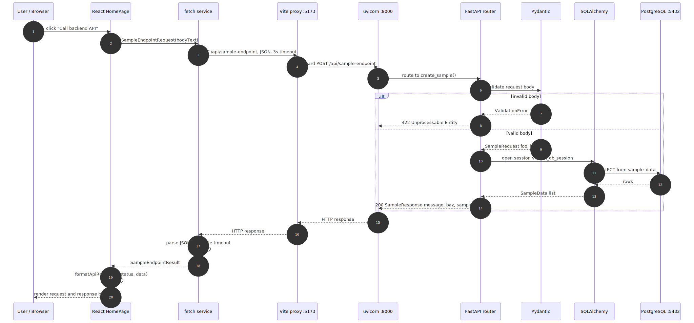

# Team 4 - Technical Design

This is the technical design document for the Team 4 project "Surplus: A Local
Produce Exchange"
([github.com/ICS613-Team4/local-produce-exchange](https://github.com/ICS613-Team4/local-produce-exchange)).
It covers six
things: the architecture diagram and its components, the technology stack, the
code quality tools, the data model, the key API endpoints, and the risks and
tradeoffs.

This is a living document. It describes the current state of the system and will
be updated as the project grows. Sections that do not have content yet are marked
PLACEHOLDER so they are easy to find and fill in later.

The build tooling, the request path from browser to database, the migration
system, the test suites, and the deployment pipeline are all in place and running
in production at https://localharvest.exchange.

---

## 1. Architecture diagram and components

Surplus is a web application split into three tiers:

- **Frontend (runs in the browser).** It is a single-page app, which means the
  browser downloads one JavaScript bundle and then builds and updates the page
  itself instead of asking the server for a fresh page on every click.
- **Backend (answers HTTP requests).** It is a separate program that the frontend
  talks to over a single contract: any URL beginning with `/api` goes to the
  backend, and everything else is the frontend.
- **Database (stores the data).** It sits behind the backend; only the backend
  talks to it, never the browser.

The same application code runs in two places, and the difference between them is
the theme that runs through this whole section. On a developer's machine
("development"), helper tools serve the code and reload it on every edit. On the
live server ("production"), longer-running programs serve the built code over an
encrypted connection and keep it running without anyone watching. The application
behaves the same way in both; what changes is the programs around it.

The rest of this section builds that picture up in layers:

- A **detailed static dev architecture view** that names every tool and where it
  sits, and a **detailed static prod architecture view** that mirrors it and marks
  only what changes in production.
- An **application runtime request path** that follows one request from a button
  click to a database row and back, so the contract above becomes concrete.
- A **development components** list (with a **local development architecture**
  diagram) and a **production components** list (with a **deployed production
  architecture** diagram), one pair per environment.
- A **dev-to-prod mapping** that lines the two environments up side by side and
  explains each difference and why it exists.

### Detailed static dev architecture view

This names every tool in the development setup and shows where it sits: npm
orchestration, the React and TypeScript frontend served by Vite, the
FastAPI/uvicorn backend, PostgreSQL in Docker, the Alembic and seed tooling, the
test and lint tools, and the GitHub Actions checks.

### Detailed static prod architecture view

This mirrors the dev view layer for layer, with the same eight groups
(orchestration, browser, the web tier, backend, database, schema and seed
tooling, quality and test tooling, and GitHub Actions). The amber boxes are the
only parts that differ from development; everything else is the same code in the
same shape.

What differs in production:

- **Orchestration.** There is no npm on the server. systemd supervises the
  backend, Docker Compose runs the database, and uv installs the Python
  dependencies, all driven by the deploy script instead of a developer typing
  npm commands.
- **Web tier.** nginx replaces the Vite dev server. It terminates TLS on `:443`
  (redirecting `:80`), serves the built `frontend/dist` with an SPA fallback, and
  proxies `/api` to the backend.
- **Backend.** The same FastAPI app, but uvicorn runs with one worker, no
  `--reload`, and `--proxy-headers`, supervised by systemd as the `deploy` user.
- **Database.** The same PostgreSQL 18.4 container, plus `restart: unless-stopped`
  so it comes back after a reboot.
- **Schema and seed.** The same Alembic and seed steps, now run by the deploy
  script on every deploy rather than by hand.
- **Quality and test tooling.** It does not run on the server at all; it runs in
  GitHub Actions, and `uv sync --no-dev` leaves pytest and ruff off the box.
- **GitHub Actions.** The same Checks workflow, with a Deploy workflow added on
  top that ships the code to the VPS.

Solid arrows are the live request path; dotted arrows are supervision, schema and
seed, and delivery.

### Application runtime request path

This traces one request from a button click in the browser all the way to a
database row and back. The diagram is a sequence diagram, read top to bottom:
each vertical line is one participant, and each arrow is one message in time
order.

#### How it works, step by step

This is a generic walkthrough of a typical interaction with the web app: one
that makes an API call and runs a database query. It follows the development
setup; production takes the same path, with nginx in place of the Vite proxy.

1. **The click.** The user clicks a button on the React Home page. Nothing
   reloads: a JavaScript event handler fires inside the page that is already
   loaded.

2. **The page calls its service.** The Home page does not talk to the network
   itself. It calls `sendSampleEndpointRequest(bodyText)` in the fetch service.
   Keeping the network code in one service file (not in the component) means the
   tests can swap it out and the component stays focused on display.

3. **The service makes the HTTP call.** The service sends
   `POST /api/sample-endpoint` with a JSON body and a 3-second timeout. Note the
   path has no host name, just `/api/...`. The browser treats it as a call to the
   same origin it was served from.

4. **Vite proxies the call to the backend.** In development the page is served by
   the Vite dev server on port 5173. Vite is configured to forward anything
   starting with `/api` to the FastAPI backend on port 8000. This is why the
   frontend code needs no host name and no CORS setup: as far as the browser
   knows, it is talking to one server, and Vite relays the call across to
   Python. (In production, nginx plays this same forwarding role.)

5. **uvicorn hands off to FastAPI.** uvicorn is the web server that holds the
   network socket and speaks HTTP. It receives the request and passes it into the
   FastAPI application, which matches the method and path to the `create_sample()`
   route function.

6. **Pydantic validates the body.** Before the route's own code runs, FastAPI
   uses Pydantic to check the incoming JSON against the `SampleRequest` shape
   (`foo: str`, `baz: int`). This is the fork in the diagram:
   - **If the body is wrong** (a missing field or a wrong type), Pydantic raises
     a validation error and FastAPI returns `422 Unprocessable Entity` right
     here. The route function never runs. This is automatic; no one writes the
     check.
   - **If the body is valid**, Pydantic produces a typed `SampleRequest` object
     and the request continues.

7. **The route gets a database session.** The route function declares the
   database session as a dependency (`get_db_session`), so FastAPI opens a fresh
   session, hands it in, and closes it again after the response. There is one
   session per request, and the framework manages its open-use-close lifecycle.

8. **SQLAlchemy reads the data.** Using that session, SQLAlchemy runs a
   `SELECT` against the `sample_data` table. PostgreSQL returns the matching
   rows, and SQLAlchemy turns them back into a list of Python `SampleData`
   objects so the route works with objects, not raw SQL result rows.

9. **The route builds the response.** The route packs the result into a
   `SampleResponse` (`message`, `baz`, and the `sample_data` list) and returns
   `200 OK`. FastAPI serializes that object to JSON on the way out, again using
   the Pydantic model to control the exact shape.

10. **The response travels back.** The JSON flows back the way it came: uvicorn
    to Vite to the fetch service. The service parses the JSON, or, if the backend
    took longer than 3 seconds, it stops waiting and reports a timeout instead.
    Either way it returns a single `SampleEndpointResult` to the page.

11. **The page renders.** The Home page calls `formatApiResult(...)` to turn the
    result into display text and updates its state. React then re-renders only
    the parts of the page that changed, showing the request that was sent and the
    response that came back, with no full page reload at any point.

The two ideas to take away: the separate processes (the frontend server, the
backend, and the database) are stitched together by the `/api` contract, and
validation happens at the edge (Pydantic) before any of the route's own logic
runs, so bad input is rejected with a clear `422` before it can reach the
database.

### Development components

Each part of the development setup has a clear job and a clear boundary.

- **Orchestration.** The root `package.json` is a task runner with no
  dependencies of its own. Every command a developer needs runs through
  `npm run ...` (for example `npm run backend`, `npm run db`, `npm run test`).
  On the Python side, Astral uv pins the interpreter and resolves dependencies
  from a lockfile. Docker Compose runs one container, the PostgreSQL database.

- **Frontend.** A React 19 single-page app written in TypeScript, built and
  served by Vite. The browser downloads a JavaScript bundle that builds and
  updates the page itself. React Router handles moving between pages without a
  full page reload. Vitest runs the frontend tests.

- **Backend.** A FastAPI app served by the uvicorn ASGI web server. FastAPI
  handles routing and dependency injection. Pydantic validates every request and
  response. All routes live under the `/api` prefix, which is the contract the
  frontend relies on.

- **Data.** PostgreSQL 18.4 stores the data. SQLAlchemy 2.0 is the ORM that maps
  Python classes to tables, and psycopg 3 is the database driver underneath.
  Alembic manages schema changes as versioned migration files.

- **Quality and CI.** pytest tests the backend (against an in-memory SQLite
  database, so no Docker is needed for tests). ruff and eslint lint the two
  languages. GitHub Actions runs lint, build, and test on every pull request,
  then deploys to the VPS on pushes to `main`.

The connecting idea: npm is the single entry point, and `/api` is the contract
between the frontend and the backend. During development, the Vite dev server
(port 5173) proxies every `/api` request to the FastAPI backend (port 8000), so
the browser sees one origin and no CORS setup is needed.

#### Local development architecture

This diagram is the simpler companion to the detailed static dev architecture
view above. It shows the main components and how they connect: solid arrows are
the live
request path, and dotted arrows are tooling that acts on a component rather than
serving traffic.

Reading the diagram: the developer runs the npm targets, which start the Vite dev
server, the backend, and the database (and drive Alembic for schema changes). The
Vite dev server hosts the React and TypeScript app and serves it to the browser
the developer opens, where the app runs. A click in the app makes an `/api` call
that Vite forwards to FastAPI. FastAPI validates with Pydantic and reads or writes
through SQLAlchemy into PostgreSQL, and the typed response flows back the same way.
GitHub Actions is not in this picture on purpose: it does not touch the developer's
machine but runs on its own Ubuntu runner on a pull request or merge, so it
appears in the production view below.

### Production components

The components and the relationships diagram above describe the development
setup, the one a developer runs on their own machine. Production runs the same
application code, but different programs serve it and keep it running. This is the
live system at https://localharvest.exchange, hosted on one VPS (a rented Linux
server: Vultr, Debian 13, at 45.77.209.138).

- **Web server and TLS (nginx).** nginx is installed on the server itself (not in
  a container). It listens on port 443 for HTTPS and on port 80 only to redirect
  visitors to HTTPS. It holds the purchased TLS certificate, so it is the piece
  that encrypts traffic. It serves the pre-built React files straight from disk
  (`frontend/dist`), and for any unknown path it returns `index.html` so React
  Router's client-side routes still work on a direct visit or a refresh. Every
  `/api` request it receives, it forwards to the backend on `127.0.0.1:8000`.
  This is the production stand-in for what Vite's proxy does in development.

- **Backend (systemd service running uvicorn).** The FastAPI app runs under
  uvicorn as a background service managed by systemd (the Linux service
  manager), named `produce-backend.service`. It runs as an unprivileged
  `deploy` user, with one worker, bound to `127.0.0.1:8000` so only nginx on the
  same machine can reach it. It uses a Python 3.14.2 virtual environment.
  systemd starts it on boot and restarts it within a few seconds if it crashes.
  There is no `--reload` in production, because the code does not change while the
  server is running.

- **Database (PostgreSQL in Docker).** The same PostgreSQL 18.4 image as
  development, started by Docker Compose. It is bound to `127.0.0.1:5432` only, so
  nothing off the server can connect to it. Its data lives in a named Docker
  volume (`produce_db_data`) that survives container restarts, and a VPS-only
  override file adds `restart: unless-stopped` so the container comes back by
  itself after a reboot.

- **App files and secrets.** Everything lives under `/opt/produce-exchange/app`
  (the `backend` folder, the built `frontend/dist`, the deploy `scripts`, and the
  Compose files). The real database password lives only in the `.env` file there,
  readable only by the `deploy` user and never committed to Git.

- **Network and firewall.** A firewall (ufw) allows only three ports from the
  internet: 22 (SSH), 80, and 443. Because the backend and the database are bound
  to localhost, the firewall plus those bindings keep them private; nginx is the
  only component the public can reach.

- **Delivery (GitHub Actions).** On every push to `main`, the Deploy workflow
  builds the frontend on the GitHub runner, copies the backend, the scripts, and
  the Compose file to the server over SSH (using rsync), then runs
  `deploy-remote.sh` on the server to install dependencies, start the database,
  apply Alembic migrations, seed, restart the backend, and health-check it. The
  built frontend is copied last, only after the backend is confirmed healthy, so
  the new page never goes live ahead of a working backend.

#### Deployed production architecture

Reading the diagram, there are two separate flows. The runtime flow: an end user
opens the browser, which loads the site over HTTPS, and nginx answers. nginx
serves the React files for normal page loads and forwards `/api` calls to the
uvicorn service on the same machine. uvicorn runs FastAPI, which validates with
Pydantic and reads or writes the PostgreSQL container through SQLAlchemy. The
backend and the database both listen on localhost only, so the browser reaches
them only through nginx. The delivery flow: a developer opens a pull request, and
merging it to `main` triggers GitHub Actions, which lints the code, builds the
frontend (the build step runs the TypeScript typecheck), and runs the tests; only
if all of those pass does it deploy to the VPS (copy the files over SSH, apply
migrations, restart the backend, and health-check it). The
request path itself (FastAPI, Pydantic, SQLAlchemy, PostgreSQL) is the same as
development; what changes is the programs around it and the gated pipeline that
delivers it.

### Dev-to-prod component mapping

The application code is identical in both places. What differs is which program
serves the page, which program forwards `/api`, who starts the processes, and the
security around them. This table lines up each development piece with its
production counterpart.

| Concern | Development | Production | Why it differs |
| --- | --- | --- | --- |
| Serve the frontend | Vite dev server on `:5173`, built in memory with hot reload | nginx serves the pre-built static files from `frontend/dist` | Development needs fast edit-and-refresh; production needs a fixed, cacheable bundle. The Vite dev server is a coding tool, not meant to face the internet. |
| Route `/api` | Vite proxy forwards `/api` to `:8000` | nginx proxies `/api` to `127.0.0.1:8000` | Same job (one origin, no CORS), different tool. Vite exists only while coding; nginx is the long-running public server. |
| Run the backend | `npm run backend` starts uvicorn with `--reload` in a terminal | systemd service, uvicorn with one worker, no reload, runs as the `deploy` user | Production must start on boot, restart on crash, run without a developer's terminal, and run as a fixed unprivileged user. `--reload` is a coding convenience production does not want. |
| HTTPS / TLS | none; plain HTTP on localhost | nginx terminates TLS with a purchased certificate; port 80 redirects to 443 | Local development does not need certificates; a public site must encrypt traffic. |
| Start everything | developer runs npm targets in three terminals (`db`, `backend`, `frontend`) | GitHub Actions, systemd, and Docker start and supervise the pieces | No person runs commands on the server; the pipeline and the init system own startup. |
| Database | PostgreSQL 18.4 in Docker, port published to the dev machine | the same PostgreSQL 18.4 in Docker, bound to `127.0.0.1` only, with `restart: unless-stopped` | The image is kept identical on purpose, for parity. Production restricts the bind to localhost and adds a restart policy for reboots. |
| Config and secrets | `.env` on the dev machine with default `produce`/`produce` credentials | `.env` at `/opt/produce-exchange/app`, mode 600, a real random password, never committed | Development can use throwaway defaults; production needs a real secret kept out of Git and unreadable by other users. |
| Deploy | not applicable; the developer just runs it locally | rsync over SSH plus `deploy-remote.sh` (migrate, restart, health-check) on push to `main` | Production needs a repeatable, gated way to ship code and to apply database migrations safely. |
| Tests and lint | `npm run test` and `npm run lint` run by hand | CI runs the same npm targets before any deploy | Same commands, but in production they gate the merge, so code that fails them never reaches the server. |

What stays the same across both: the request shape (browser to a proxy to
FastAPI to Pydantic to SQLAlchemy to PostgreSQL), the `/api` contract, the
PostgreSQL 18.4 image, and the same npm-driven test and lint commands. What
changes is who serves the page, who starts the processes, and the security around
them (TLS, the firewall, the localhost bindings, and a real secret).

---

## 2. Technology stack

### Frontend

| Tool | Version | Role |
| --- | --- | --- |
| React | 19.2 | UI library, builds and updates the page in the browser |
| React DOM | 19.2 | Mounts React into the page |
| React Router | 7.17 | Client-side page navigation |
| TypeScript | ~6.0 | Build-time static type checking |
| Vite | 8.0 | Dev server, hot reload, production bundler, `/api` proxy |
| Vitest | 4.1 | Frontend test runner |
| React Testing Library | 16.3 | Renders and queries components in tests |
| jsdom | 28.1 | Fake browser DOM for component tests |
| Sass | 1.100 | SCSS stylesheet compilation |
| eslint | 10.3 | JavaScript/TypeScript linter (flat config) |
| Node.js | 20.19+ or 22.12+ | Runtime for the frontend toolchain |

Each tool in more detail:

- **React.** The UI library. You describe what the screen should look like for a
  given state, and React updates the page to match. The entry point `main.tsx`
  mounts the `App` component into the single root `div` in `index.html`, and
  `App.tsx` is the root component. Component state lives in hooks such as
  `useState` and `useRef`.
- **React DOM.** The part of React that mounts the components into the actual
  page in the browser.
- **React Router.** Moves between pages (for example `/` to the Home page and
  `/about` to the About page) without a full page reload.
- **TypeScript.** JavaScript with a static type layer added on. Types are checked
  at build time and then erased, so the browser runs plain JavaScript. Strict
  checks are on, and the build runs `tsc -b` before the bundle step, so a type
  error fails the build before any bundle is produced.
- **Vite.** Two tools in one: the dev server used while coding and the bundler
  that produces the production build. In development it serves the source with hot
  module replacement, so edits show up without a full reload. Its dev proxy
  forwards every `/api` request from port 5173 to the backend on port 8000, which
  is why the frontend can call `/api` with no host name and no CORS setup. It
  binds the host to `127.0.0.1` on purpose, to avoid an IPv6 resolution quirk on
  Windows.
- **Vitest.** The frontend test runner. It reuses the Vite config, so tests
  transform code the same way the app does. Component tests run under jsdom with
  React Testing Library; network calls are replaced with a stub, so a test can
  assert the exact URL, method, and timeout without a running backend.
- **React Testing Library.** Renders components and queries the rendered output
  the way a user would see and use it.
- **jsdom.** A fake browser DOM that lets component tests run without a real
  browser.
- **Sass.** Compiles SCSS stylesheets (for example `styles/global.scss`) into
  CSS.
- **eslint.** The JavaScript and TypeScript linter, using the flat-config style
  with the typescript-eslint and React Hooks rule sets.
- **Node.js.** The runtime the frontend toolchain (Vite, Vitest, eslint) runs on.

### Backend

| Tool | Version | Role |
| --- | --- | --- |
| Python | 3.14.2 | Backend language |
| FastAPI | 0.115.x | Web framework: routing, DI, OpenAPI docs |
| uvicorn | 0.30+ | ASGI web server that hosts the app |
| Pydantic | 2.x | Request/response validation and JSON serialization |
| SQLAlchemy | 2.0 | ORM, one session per request |
| psycopg | 3.2 (binary) | PostgreSQL client driver |
| Alembic | 1.16 | Versioned database migrations |
| python-dotenv | 1.2.2 | Loads `.env` configuration |
| pytest | 9.0.3 | Backend test framework |
| ruff | 0.15.16 | Python linter and formatter |

Each tool in more detail:

- **Python.** The backend language, pinned to 3.14.2.
- **FastAPI.** The web framework. It provides routing, dependency injection, and
  request and response validation. `app/main.py` creates the app and mounts the
  routers under the `/api` prefix. Routes are plain functions marked with the HTTP
  method and path, and dependencies are injected with `Depends(...)`. FastAPI also
  generates OpenAPI/Swagger documentation from the type hints, so the API
  describes itself with no extra annotations.
- **uvicorn.** The ASGI web server that holds the network socket and speaks HTTP.
  FastAPI is just application code; uvicorn is what runs it. In development it is
  launched with `--reload`, so saving a Python file restarts the server.
- **Pydantic.** The data validation and serialization layer (version 2). You
  declare a class with typed fields (`SampleRequest` has `foo: str` and
  `baz: int`), and FastAPI uses it to parse and validate incoming JSON. If a
  client sends the wrong type or omits a field, FastAPI returns a `422` with a
  structured error before your code runs. Response models such as `SampleResponse`
  control the shape of the JSON sent back.
- **SQLAlchemy.** The ORM (version 2.0). It maps the `SampleData` Python class to
  the `sample_data` table so handlers work with objects instead of raw SQL.
  `app/db.py` builds the connection URL from environment variables, creates the
  engine with `pool_pre_ping=True` so dead pooled connections are caught before
  use, and exposes a `get_db_session()` generator that is the unit of work for one
  request.
- **psycopg.** The PostgreSQL client driver (version 3) that SQLAlchemy uses
  underneath to talk to the database (`postgresql+psycopg`).
- **Alembic.** Database migrations. It records schema changes as versioned Python
  files. Its `env.py` imports the SQLAlchemy metadata, so a new migration can be
  autogenerated by comparing the models against the live database. The first
  migration creates the `sample_data` table, and Alembic tracks which migration a
  database is on in its own `alembic_version` table.
- **python-dotenv.** Loads settings from the `.env` file so the app and the
  migrations read the same configuration.
- **pytest.** The backend test framework. Tests call the code directly rather
  than over HTTP, and they spin up an in-memory SQLite database built from the
  same models, so the suite is fast and needs no Docker or PostgreSQL.
- **ruff.** The Python linter and formatter. It also formats the autogenerated
  migration files through an Alembic post-write hook.

### Data and infrastructure

| Tool | Version | Role |
| --- | --- | --- |
| PostgreSQL | 18.4 | Relational database (in Docker) |
| Docker Compose | n/a | Runs the single `db` container |
| Astral uv | 8.2.0 (CI) | Python dependency and interpreter manager |
| GitHub Actions | n/a | CI (lint, build, test) and CD (deploy to VPS) |
| nginx | 1.26 | TLS proxy and static file server in production |

Each tool in more detail:

- **PostgreSQL.** The database, version 18.4, running in Docker. It listens on
  `127.0.0.1:5432` and stores its files in a named volume (`produce_db_data`) so
  data survives container restarts. A `pg_isready` health check lets startup wait
  until the database accepts connections before anything tries to use it.
- **Docker Compose.** Runs the single `db` container, the lightest use of
  containers: just enough to give every developer the same database version. One
  command starts, stops, and wipes that database.
- **Astral uv.** The Python side of the toolchain. It pins the interpreter
  (3.14.2), resolves dependencies, and writes a `uv.lock` lockfile; the `--locked`
  flag everywhere means CI and every developer install the identical dependency
  graph. Every Python process is launched through `uv run`.
- **GitHub Actions.** The CI and CD service. The Checks workflow runs on every
  pull request and on pushes to `main`, on a fresh Ubuntu runner with Node and uv,
  running the same npm targets a developer would (setup, lint, build, test). The
  Deploy workflow ships the code to the VPS after the checks pass.
- **nginx.** In production it terminates TLS and serves the built frontend, and
  it proxies `/api` to the backend. It is the production stand-in for Vite's dev
  proxy.

---

## 3. Code quality tools

The project keeps the code correct and consistent with three kinds of tools:
linters that flag problem patterns, a type checker that catches type errors
before the code runs, and two test suites, one per language. The same toolset is
used while developing and again in the delivery pipeline; what changes is who
runs the tools and when. Both subsections below are split into development and
production.

### Tools that will be utilized

#### Development

On a developer's machine, the full toolset is available and run by hand:

- **eslint** - the JavaScript and TypeScript linter for the frontend. It uses the
  flat-config style with the typescript-eslint and React Hooks rule sets, so it
  catches general problems and React-specific mistakes (for example, misuse of
  hooks).
- **ruff** - the Python linter and formatter for the backend. It is a fast
  checker, and it also formats the autogenerated Alembic migration files through a
  post-write hook, so generated files match the project style.
- **TypeScript (tsc)** - the type checker. `tsc -b` checks types across the
  project references with strict checks on; a type error fails the build before
  any bundle is produced. A standalone `npm run typecheck` target runs this check
  on its own.
- **Vitest** - the frontend test runner. It reuses the Vite config, so tests
  transform code the same way the app does.
- **React Testing Library** - renders components and queries the rendered output
  the way a user would, used inside the Vitest component tests.
- **jsdom** - a fake browser DOM that lets component tests run without a real
  browser. Network calls are replaced with a stub, so a test can assert the exact
  URL, method, and timeout without a running backend.
- **pytest** - the backend test framework. Tests call the route and helper
  functions directly rather than over HTTP, and they spin up an in-memory SQLite
  database built from the same SQLAlchemy models, so the suite is fast and needs
  no Docker or PostgreSQL.

These are bundled behind a few npm targets, so one command runs each group:
`npm run lint` (eslint and ruff), `npm run typecheck` (tsc), and `npm run test`
(Vitest and pytest, with `test:frontend` and `test:backend` for one side at a
time).

#### Production

Production adds no new quality tools, and the live server runs none of them. The
same tools listed above run earlier, in the GitHub Actions pipeline, as a gate
before code is deployed:

- **eslint** and **ruff** run in the Checks workflow's lint step.
- **TypeScript (tsc)** runs as part of the build step (`tsc -b` before the bundle).
- **Vitest** and **pytest** run in the test step.
- **React Testing Library** and **jsdom** are part of the Vitest frontend tests
  only; like the others, they never ship to the server.

The production VPS installs only runtime dependencies with `uv sync --no-dev`,
which deliberately leaves pytest and ruff off the box. No linter, type checker, or
test runner is present on the live server.

### When and where will they be executed

#### Development

- **Where.** On the developer's own machine.
- **When.** By hand while coding, before committing or opening a pull request.
- **How.** `npm run lint` (eslint + ruff), `npm run typecheck` (tsc), and
  `npm run test` (Vitest + pytest). Because each target runs both languages, one
  command covers the whole codebase.
- **No external services.** Vitest uses jsdom and stubbed network calls, and
  pytest uses in-memory SQLite, so neither needs Docker or a running database.

The diagram below shows the development workflow. It and the production diagram
that follows share the same three check steps (the white boxes: lint, typecheck,
test); the amber boxes are the parts that differ between the two.

The development loop is manual and fast, driven by the developer. After editing
code, the developer runs the three checks (in practice often all at once).
`npm run lint` runs eslint across the React and TypeScript code and ruff across
the Python code in one command. `npm run typecheck` runs `tsc -b`, which checks
types across the project references without building a bundle, so it returns
quickly. `npm run test` runs both suites: Vitest renders components under jsdom
with React Testing Library and replaces network calls with stubs, while pytest
exercises the backend against an in-memory SQLite database. Because nothing here
needs Docker or a running database, the loop stays quick enough to run on every
change. If a check fails, the developer fixes the code and re-runs; when all three
pass, they commit and open a pull request. Nothing in this loop blocks anything
automatically: the discipline is the developer's, and the enforced gate comes
later, in CI.

#### Production

- **Where.** On a fresh GitHub Actions Ubuntu runner (the delivery pipeline),
  never on the production VPS.
- **When.** On every pull request and on merge to `main`.
- **How.** The Checks workflow runs the same npm targets a developer would:
  `npm run setup`, then `lint`, then `build` (which runs the `tsc` typecheck),
  then `test`. Because CI runs the identical commands, "passes locally" and
  "passes in CI" mean the same steps.
- **As a gate.** The Deploy workflow's deploy step depends on the checks passing,
  so code that fails a linter, the type check, or a test never reaches production.

The diagram below is the same three checks wrapped in an automated, gated
pipeline. Compared with the development loop, the amber boxes are what differs:
the trigger, an added setup step, and the outcome.

Opening a pull request, or merging one into `main`, triggers the Checks workflow
on a fresh Ubuntu runner: a clean machine each time, so results never depend on a
developer's local setup. Because the runner starts empty, the pipeline first runs
`npm run setup` to install both the frontend and backend dependencies (this step
has no equivalent in the development loop, where the dependencies are already
installed). It then runs the same three checks as development, with one wrinkle:
the TypeScript typecheck runs as part of `npm run build` (before the Vite bundle)
rather than as a standalone command. As in development, the tests need no external
services. The outcome is the real difference: if any step fails, the workflow
fails and the pull request is blocked, so nothing deploys; if every check passes
and the event was a merge to `main`, the Deploy job ships the code to the VPS.
This is the gate that guarantees code reaching production has passed the identical
checks a developer runs locally.

---

## 4. Data model (ERD)

PLACEHOLDER. This section will hold the data model ERD.

---

## 5. Key API endpoints

PLACEHOLDER. This section will list the key API endpoints.

---

## 6. Risks and tradeoffs

These are the design tradeoffs the team has already made (with their upsides),
plus the open risks that should be tracked.

### Tradeoffs already made

- **Tests run against in-memory SQLite, not PostgreSQL.** Upside: the test suite
  is fast and needs no Docker or running database. Risk: SQLite and PostgreSQL
  differ in type handling, constraints, and SQL behavior, so a test can pass
  while real Postgres behaves differently. Anything that depends on
  Postgres-specific features will not be caught by the unit tests.

- **One container for the database only; everything else runs on the host.**
  Upside: the simplest possible setup; every developer gets the same database
  version with one command. Risk: the frontend and backend are not containerized,
  so "works on my machine" can still drift from the production server even though
  the database matches.

- **The `/api` proxy avoids CORS in development.** Upside: the React code can
  call `/api/...` with no host name and no CORS configuration. Tradeoff: this
  convenience only exists in the Vite dev server. Production relies on nginx to
  route `/api` to the backend, so the dev and production routing paths are
  different and must both be kept correct.

- **Strict dependency pinning with lockfiles and `--locked`.** Upside: CI and
  every developer install the identical dependency graph, so builds are
  reproducible. Tradeoff: upgrades require a deliberate lockfile update; you do
  not get fixes or security patches automatically.

- **Auto-deploy to a single VPS on every push to `main`.** Upside: shipping is
  one merge; the pipeline runs the same npm commands as local development.
  Risk: a single server is a single point of failure, and there is no staging
  environment between `main` and production.

### Open risks

- **No authentication or authorization.** There is no concept of a logged-in
  user, sessions, or permissions in the code. Any feature that needs to know
  "who is doing this" will require this to be designed and added first.

- **Migrations cannot be undone in production.** A code rollback is a git revert,
  but a database migration that has already run cannot be automatically reversed.
  Schema changes need care.

- **Cleartext default database credentials in config defaults.** The default
  username and password are both `produce`. This is fine for local development
  but the production secret handling should be confirmed (the deploy excludes
  `.env`, so production uses its own values, but this should be verified).

- **TLS certificate has a fixed expiry (2026-12-21).** Renewal needs to be
  tracked so the site does not go down when it lapses.
